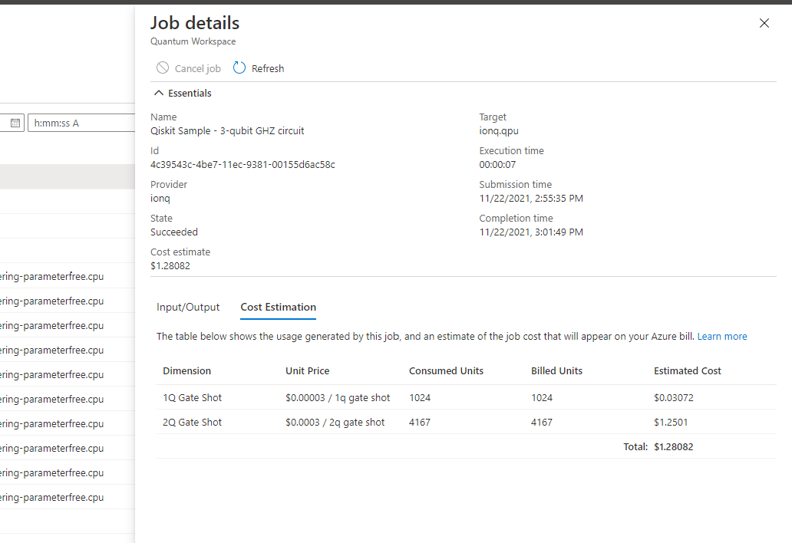

# Azure Quantum job costs
This article helps you understand the cost of jobs in Azure Quantum. 

## Before you start: Understanding job pricing
Azure Quantum makes solutions available from our partner companies, so the billing details can between Providers and the pricing plans you select. Below is some general information on pricing in Azure Quantum, and details for each provider.

General pricing guidance:

- You can only use general-purpose Azure Credits with the Microsoft providers. 3rd-party providers (providers that aren't Microsoft) are not eligible. For these providers, you may consider applying to the [Azure Quantum Credits Program](https://aka.ms/aq/credits).

- Most providers bill based on the resources you consume by running a job, though some also offer subscription plans. For more information, review the subscription plans available to you in the Azure Portal.

### Honeywell pricing
Honeywell uses a credit system called *Honeywell Quantum Credits*. Each job you run consumes credits from your balance based on the number of operations in the job, and the number of shots you run. You can find more information on Honeywell Quantum Credits on the [Honeywell Provider page](xref:microsoft.quantum.providers.honeywell).

You may purchase Honeywell Quantum Credits through various plans. Go to the [Azure Portal](https://aka.ms/AQ/CreateWorkspace) and select the Honeywell provider for the most up to date list of subscription plans available.

### IonQ pricing
IonQ charges based on the number of gates in your program, the complexity of the gates you use, and the number of shots. These units are called `qubit-gate-shots` and you can find more information about how they are calculated on the [IonQ Provider Page](xref:microsoft.quantum.providers.ionq).

> Note: IonQ has minimum job costs. For small jobs, you may notice that `Consumed Units` reported on the job cost estimation table are less than the `Billed Units` for this reason.

IonQ uses a pay-as-you-go model with no monthly subscription fees. To see the current service costs, go to the [Azure Portal](https://aka.ms/AQ/CreateWorkspace) and select the IonQ provider for the list of available subscription plans.

### 1QBit pricing
1QBit charges through a subscription model or a pay-as-you-go model based on the runtime of your optimization problem. You can find more information about 1QBit's offering on the [1QBit Provider Page](xref:microsoft.quantum.providers.optimization.1qbit).

### Microsoft Optimization pricing
Microsoft Optimization Solutions charges based on the runtime of your optimization problem, in seconds. Per-second rates are based on the plan you select and the volume of optimization jobs you run within a month. See the [Microsoft Optimization Pricing Page](https://azure.microsoft.com/pricing/details/azure-quantum/) for more information.

## After you run: Job cost reporting
After you run a job, Azure Quantum makes available detailed cost estimates for supported providers. You can use this information to understand the cost of individual jobs. This cost is the cost billed by the provider; refer to your final bill for the exact charges including relevant taxes.

To review job costs, navigate to the **Job Management** blade within your Azure Quantum Workspace. In the job list, you will see estimated costs reported for each job you've run (where supported). To see more information, click on a job that shows pricing information.

> Note: Some Azure Quantum providers do not support reporting per-job costs, however you can still see your current bill **TODO: Link to section with instructions for reviewing customers total bill for providers.**

To review detailed cost estimate information for a job, select the job in the Job Management pane and then open the "Cost Estimation" tab. The table displays the billing dimensions used by the job and their associated cost.

How to interpret the Cost Estimation table columns:
- `Dimension`: The name of the dimension you are charged for by the provider. This represents an aspect of the job that you run that you are billed for.
- `Unit Price`: The cost of one unit of the dimension.
- `Consumed Units`: How many units of the dimension the job consumed.
- `Billed Units`: How many units you were actually billed for. In some cases, this column may be less than _Consumed Units_ if the providers billing plan offers an amount of included free usage or is credits-based. This column may also be less than _Consumed Units_ in the event that a provider has a minimum job cost and the actual units consumed were less than required to satisfy the requirement.
- `Estimated Cost`: The estimated cost for this dimension, and equals `[Billed Units] * [Unit Price]`

The total row at the bottom shows the total cost of all dimensions for processing the job.