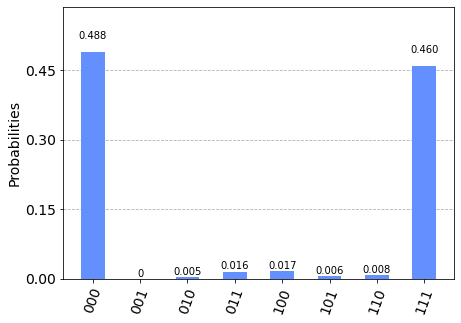

## Define a simple circuit

Next, create a simple Cirq circuit to run. In a new cell, add and run the following code to create and display a random number generator circuit. 

```python
import cirq

q0, q1 = cirq.LineQubit.range(2)
circuit = cirq.Circuit(
    cirq.H(q0), # Hadamard
    cirq.CNOT(q0, q1), # CNOT
    cirq.measure(q0, q1, key='b') # Measure both qubits
)
print(circuit)
```

```output
0: ───H───@───M────────
          │   │
1: ───────X───M────────
```

## List all targets

[!INCLUDE [Quantinuum target name update](quantinuum-name-change.md)]

Use the `targets()`method to list all the targets in your workspace that can run your circuit, including the
current queue time and availability.

> [!NOTE]
> All the targets in your workspace may not be listed - only the targets that can accept a Cirq or OpenQASM circuit will be listed here. 

```python
print("This workspace's targets:")
for target in service.targets():
     print(target)
```

```output
This workspace's targets:
<Target name="quantinuum.qpu.h1-1", avg. queue time=0 s, Degraded>
<Target name="quantinuum.sim.h1-1sc", avg. queue time=1 s, Available>
<Target name="quantinuum.qpu.h1-2", avg. queue time=217300 s, Unavailable>
<Target name="quantinuum.sim.h1-2sc", avg. queue time=0 s, Available>
<Target name="quantinuum.sim.h1-1e", avg. queue time=40 s, Available>
<Target name="quantinuum.sim.h1-2e", avg. queue time=64 s, Available>
<Target name="ionq.qpu", avg. queue time=229 s, Available>
<Target name="ionq.simulator", avg. queue time=3 s, Available>
<Target name="ionq.qpu.aria-1", avg. queue time=1136774 s, Available>
```

## Select a target and run your program

To check your circuit before running it on actual quantum hardware, you can use the Quantinuum API Validator, `quantinuum.sim.h1-1sc`.

Add the following cell that submits a job to run the circuit with
100 shots, or repetitions, waits until the job is complete, and returns the results:

```python
result = service.run(
    program=circuit,
    repetitions=100,
    target="quantinuum.sim.h1-1sc"
)
```

This returns a `cirq.Result` object.

```python
print(result)
```

```output
    b=0000000000000000000000000000000000000000000000000000000000000000000000000000000000000000000000000000
```

You can plot the results in a histogram:

```python
import pylab as pl

pl.hist(result.data)
pl.ylabel("Counts")
pl.xlabel("Result")
```

Looking at the histogram, you may notice that the random number generator returned 0 every time, which is not very random. This is because that, while the API Validator ensures that your code will run successfully on Quantinuum hardware, it also returns 0 for every quantum measurement. For a true random number generator, you need to run your circuit on quantum hardware.

## Estimate job cost

Before running a job on actual quantum hardware, or a [quantum processing unit](xref:microsoft.quantum.target-profiles) (QPU), you can estimate how much it will cost to run. To estimate the cost of running a job on the QPU, you can use the `estimate_cost` method:

```python
cost = service.estimate_cost(
    program=circuit,
    repetitions=100,
    target="quantinuum.qpu.h1-1"
)

print(f"Estimated cost: {cost.estimated_total}")
```

```output
Estimated cost: 5.42
```

This prints the estimated cost in H-System Quantum Credits (HQCs).

For the most current pricing details, see [Azure Quantum pricing](xref:microsoft.quantum.providers-pricing#quantinuum), or view pricing options in the **Providers** blade of your workspace. To see your current credit status and usage, select **Credits and quotas**.

## Run on a Quantinuum QPU

After running successfully on the API validator and estimating the QPU cost, it's time to run your circuit on the hardware. 

> [!NOTE]
> The time required to run a circuit on the QPU depends on current queue times. You can view the average queue time for a target by selecting the **Providers** blade of your workspace.

Use the same `run` method and operations that you used previously with the API Validator to submit your job and display the results:

```python
result = service.run(
    program=circuit,
    repetitions=100,
    target="quantinuum.qpu.h1-1"
)
```

```python
pl.hist(result.data)
pl.ylabel("Counts")
pl.xlabel("Result")
```

You can see that the results now are roughly divided between 0 and 1.



## Asynchronous workflow using Jobs

For long-running circuits, it can be useful to run them asynchronously.
The `service.create_job` method returns a `Job` object, which you can use to
get the results after the job has run successfully.

```python
job = service.create_job(
    program=circuit,
    repetitions=100,
    target="quantinuum.qpu.h1-1"
)
```

To check on the job status, use `job.status()`:

```python
print(job.status())
```

```output
'Waiting'
```

To wait for the job to complete and then get the results, use the blocking
call `job.results()`:

```python
result = job.results()
print(result)
```

```output
{'m_b': ['11', '11', '00', '11', '00', '00', '00', '00', '11', '00', '00', '11', '00', '00', '00', '00', '11', '11', '11', '00', '11', '00', '00', '11', '11', '11', '11', '00', '00', '00', '00', '00', '00', '11', '11', '00', '11', '00', '11', '11', '00', '00', '00', '11', '11', '00', '00', '11', '11', '11', '00', '00', '11', '11', '11', '11', '00', '00', '11', '11', '00', '11', '11', '00', '00', '00', '11', '11', '11', '11', '11', '00', '00', '11', '00', '11', '11', '11', '11', '00', '11', '00', '00', '00', '01', '11', '11', '00', '00', '11', '11', '11', '11', '00', '00', '00', '11', '00', '11', '00']}
```

> [!NOTE]
> The `job.results()` function does not return a `cirq.Result` object. Instead, it returns a dictionary of bitstring measurement results indexed by measurement key.
