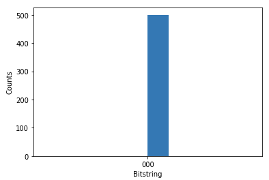
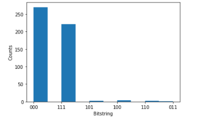

## Define a quantum circuit

Open a new cell and create a quantum circuit in the [OpenQASM](https://en.wikipedia.org/wiki/OpenQASM) representation. For example, the following example creates a Teleportation circuit:

```py
circuit = """OPENQASM 2.0;
include "qelib1.inc";
qreg q[3];
creg c0[3];
h q[0];
cx q[0], q[1];
cx q[1], q[2];
measure q[0] -> c0[0];
measure q[1] -> c0[1];
measure q[2] -> c0[2];
"""
```

## List all targets

List all the targets that you have access to, including the
current queue time and availability.

In a new cell, run:

```python
print("This workspace's targets:")
for target in service.targets():
     print(target)
```

```output
This workspace's targets:
<Target name="quantinuum.hqs-lt-s1", avg. queue time=0 s, Unavailable>
<Target name="quantinuum.hqs-lt-s1-apival", avg. queue time=1 s, Available>
<Target name="quantinuum.hqs-lt-s2", avg. queue time=75362 s, Available>
<Target name="quantinuum.hqs-lt-s2-apival", avg. queue time=0 s, Available>
<Target name="quantinuum.hqs-lt-s1-sim", avg. queue time=195 s, Available>
<Target name="quantinuum.hqs-lt", avg. queue time=0 s, Available>
<Target name="ionq.qpu", avg. queue time=229 s, Available>
<Target name="ionq.simulator", avg. queue time=3 s, Available>
```

## Select a target and run your program

To check your circuit before running it on actual quantum hardware, you can use the [Quantinuum API validator](xref:microsoft.quantum.providers.honeywell#api-validator), `quantinuum.hqs-lt-s1-apival`, which returns a `Job` object. For more information, see [Azure Quantum Job](xref:microsoft.quantum.optimization.job-reference).

Run the following code to set the target to the API Validator and submit your circuit with 500 shots:

```python
target = workspace.get_targets(name="quantinuum.hqs-lt-s1-apival")
job = target.submit(circuit, num_shots=500)
```

Wait until the job is complete and then fetch the results.

```python
results = job.get_results()
print(results)
```

```output
........
{'c0': ['000',
'000',
'000',
'000',
'000',
'000',
'000',
...
]}
```

You can also visualize the results using [Matplotlib](https://matplotlib.org/stable/users/installing/index.html).

```python
import pylab as pl

pl.hist(results["c0"])
pl.ylabel("Counts")
pl.xlabel("Bitstring")
```



Looking at the histogram, you may notice that all the measurements are 0.  This is because that, while the Quantinuum API validator target ensures that your code will run successfully on Quantinuum hardware, it also returns 0 for every quantum measurement. For an accurate measurement of your circuit, you need to run it on quantum hardware.

## Estimate job cost to run on quantum hardware

Before running a job on actual quantum hardware, or a [quantum processing unit](xref:microsoft.quantum.target-profiles) (QPU), you can estimate how much it will cost to run. To estimate the cost of running a job on the QPU, you can use the `estimate_cost` method.

The following code changes the target to the System Model H1, Powered by Honeywell, `quantinuum.hqs-lt-s1`, and uses the `estimate_cost` method to estimate the cost of running the job:

```python
target = workspace.get_targets(name="quantinuum.hqs-lt-s1")
cost = target.estimate_cost(circuit, num_shots=500)

print(f"Estimated cost: {cost.estimated_total}")
```

```output
Estimated cost: 8.6
```

This prints the estimated cost in H-System Quantum Credits (HQCs).

For the most current pricing details, see [System Model H1, Powered by Honeywell](xref:microsoft.quantum.providers.quantinuum#quantinuum-system-model-h1), or view pricing options in the **Providers** blade of your workspace. To see your current credit status and usage, select **Credits and quotas**.

## Run on a Quantinuum QPU 

After running successfully on the API validator and estimating the QPU cost, it's time to run your circuit on the hardware. 

> [!NOTE] 
> The time required to run a circuit on the QPU depends on current queue times. You can view the average queue time for a target by selecting the **Providers** blade of your workspace.

Use the same `submit` method and operations that you used previously with the API Validator to submit your job and display the results:

```python
target = workspace.get_targets(name="quantinuum.hqs-lt-s1")
job = target.submit(circuit, num_shots=500)
```

```python
results = job.get_results()
print(results)

pl.hist(results["c0"])
pl.ylabel("Counts")
pl.xlabel("Bitstring")
```



Note that the measurements now are roughly split between 0 and 1.
