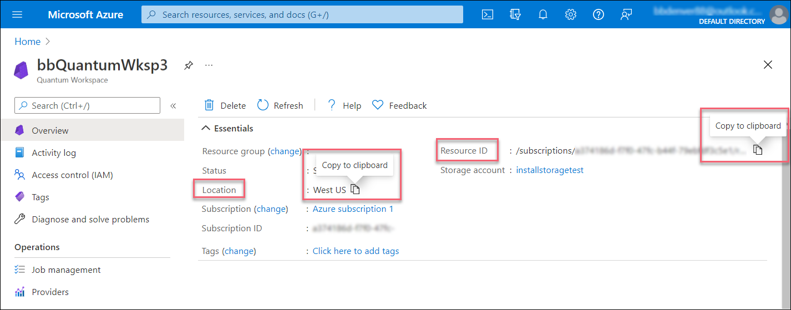

## Install the `azure-quantum` Python package

The `azure-quantum` Python package contains the necessary functionality for connecting to an Azure Quantum workspace and submitting quantum circuits to the quantum computing targets such as [IonQ](xref:microsoft.quantum.providers.ionq) and [Honeywell](xref:microsoft.quantum.providers.honeywell).

1. Install [Python](https://www.python.org/downloads/) 3.6 or later in case you haven't already.
1. Install [PIP](https://pip.pypa.io/en/stable/) and ensure you have **version 19.2 or higher**.
    > Optionally, if you are using [Miniconda](https://docs.conda.io/en/latest/miniconda.html) or [Anaconda](https://www.anaconda.com/products/individual#Downloads), create a new environment by downloading the [environment.yml](https://github.com/microsoft/qdk-python/blob/main/azure-quantum/environment.yml) file and running the following:

    >```shell
    >conda env create -f environment.yml
    >```

    > This creates a new conda environment that you can activate with the following:

    >```shell
    >conda activate azurequantum
    >```

1. Install the `azure-quantum` package using pip. Use the `--upgrade` flag to make sure to get the latest version.

    ```shell
    pip install --upgrade azure-quantum
    ```

1. Start your favorite code editor or interactive Python tool, such as [VS Code](https://code.visualstudio.com/docs/python/jupyter-support-py), [Jupyter](https://jupyter.readthedocs.io/en/latest/content-quickstart.html) or [iPython](https://ipython.readthedocs.io/en/stable/interactive/tutorial.html).


## Load the required imports

First, run the following cell to load the required imports:

```python
from azure.quantum import Workspace
```

## Connect to the Azure Quantum service

To connect to the Azure Quantum service, your program will need the resource ID and the
location of your Azure Quantum workspace. Log in to your Azure account,
<https://portal.azure.com>, navigate to your Azure Quantum workspace, and
copy the values from the header.



Paste the values into the following `Workspace` constructor to
create a `workspace` object that connects to your Azure Quantum workspace.

```python
workspace = Workspace(
    resource_id="",
    location=""
)
```

## Submit a quantum circuit to IonQ

1. Create a quantum circuit using the the language-agnostic JSON format supported by the [IonQ targets](xref:microsoft.quantum.providers.ionq), as described in the [IonQ API documentation](https://docs.ionq.com/#tag/quantum_programs). For example, the following sample creates a superposition between three qubits:

    ```python
    circuit = {
        "qubits": 3,
        "circuit": [
            {
            "gate": "h",
            "target": 0
            },
            {
            "gate": "cnot",
            "control": 0,
            "target": 1
            },
            {
            "gate": "cnot",
            "control": 0,
            "target": 2
            },
        ]
    }
    ```

1. Submit the circuit to the IonQ target. The following example uses the IonQ simulator, which returns a `Job` object. For more information, see [Azure Quantum Job](xref:microsoft.quantum.optimization.job-reference).

    ```python
    target = workspace.get_targets(name="ionq.simulator")
    job = target.submit(circuit)
    ```

1. Wait until the job is complete and then fetch the results.

    ```python
    results = job.get_results()
    print(results)
    ```

    ```output
    .....
    {'duration': 8240356, 'histogram': {'0': 0.5, '7': 0.5}}
    ```

1. You can then visualize the results using [Matplotlib](https://matplotlib.org/stable/users/installing.html).

    ```python
    import pylab as pl
    pl.rcParams["font.size"] = 16
    hist = {format(n, "03b"): 0 for n in range(8)}
    hist.update({format(int(k), "03b"): v for k, v in results["histogram"].items()})
    pl.bar(hist.keys(), hist.values())
    pl.ylabel("Probabilities")
    ```


