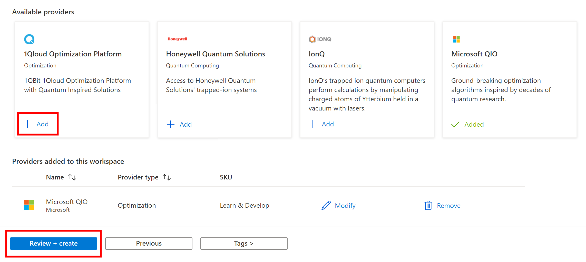

## Prerequisites

- To complete this tutorial you need an Azure subscription. If you don't have
  an Azure subscription, create a [free account](https://azure.microsoft.com/free/) before you begin.

## Create an Azure Quantum workspace

You use the Azure Quantum service by adding an Azure Quantum workspace resource to your Azure subscription in the Azure portal. An Azure Quantum workspace resource, or workspace for short, is a collection of assets associated with running quantum or optimization applications.

To open the Azure Portal, go to <https://portal.azure.com> and then follow these steps:

1. Click **Create a resource** and then search for **Azure Quantum**. On the results page, you should see a tile for the **Azure Quantum (preview)** service.

   

1. Click **Azure Quantum (preview)** and then click  **Create**. This opens a form to create a workspace.

   

1. Fill out the details of your workspace:
   - **Subscription:** The subscription that you want to associate with this
     workspace.
   - **Resource group:** The resource group that you want to assign this workspace to.
   - **Name:** The name of your workspace.
   - **Region:** The region for the workspace.
   - **Storage Account**: The Azure storage account to store your jobs and results. If you don't have an existing storage account, click **Create a new storage account** and complete the necessary fields. For this preview, we recommend using the default values.

   

   > [!NOTE]
   > You must be an Owner of the selected resource group to create a new storage account. For more information about how resource groups work in Azure, see [Control and organize Azure resources with Azure Resource Manager](/learn/modules/control-and-organize-with-azure-resource-manager/).

1. After completing the information, click the **Providers** tab to add providers to your workspace. A provider gives you access to a quantum service, which can be quantum hardware, a quantum simulator, or an optimization service.

   

   > [!NOTE]
   > By default, the Azure Quantum service adds the Microsoft QIO provider to every workspace.

1. Add at least the 1Qloud Optimization Platform provider, then click **Review + create**.

1. Review the setting you've selected and if everything is correct, click **Create** to create your workspace.

   

> [!NOTE]
> Pricing for Azure Quantum varies by provider. Please consult the information in the Providers tab of your Azure Quantum workspace in the Azure portal for the most up-to-date pricing information, or visit the [Azure Quantum pricing page](https://azure.microsoft.com/pricing/details/azure-quantum/).

## Install the Python SDK for Azure Quantum

To implement a solution, first ensure that you have the Python SDK for Azure Quantum installed on your machine. If you don't have it installed yet, follow these steps:

1. Install [Python](https://www.python.org/downloads/) 3.6 or later in case you haven't already.
1. Install [PIP](https://pip.pypa.io/en/stable/) and ensure you have **version 19.2 or higher**.
1. Install the `azure-quantum` python package.

   ```Shell
   pip install --upgrade azure-quantum
   ```

## Jupyter Notebooks installation

Optionally, you can choose to interact with Azure Quantum optimization using Jupyter Notebooks. In order to do this, you need to:

1. Install the Python SDK for Azure Quantum (as described in the previous section)
2. [Install Jupyter Notebooks](https://jupyter.org/install)
3. In your terminal of choice, use the following command to launch a new Jupyter Notebook:

    ```Shell
    jupyter notebook
    ```

    This launches a new browser window (or a new tab) showing the Notebook Dashboard, a sort of control panel that allows you (among other things) to select which notebook to open.

4. In the browser view, select the dropdown button on the right hand top corner and select ```Python 3``` from the list. This should create a new notebook.

## Create and connect to an Azure Quantum workspace

A `Workspace` represents a Azure Quantum workspace and is the main interface for interacting with the service.

```py
from typing import List
from azure.quantum.optimization import Term
from azure.quantum import Workspace

workspace = Workspace (
    subscription_id = "",  # Add your subscription_id
    resource_group = "",   # Add your resource_group
    name = "",             # Add your workspace name
    location = ""          # Add your workspace location (for example, "westus")
    )
```

The first time you run a method which interacts with the Azure service, a window might prompt in your default browser asking for your credentials.
You can optionally pass a credential to be used in the authentication in the construction of the `Workspace` object or via its `credentials` property.
See more at [Azure.Quantum.Workspace](xref:microsoft.quantum.optimization.workspace)

> [!NOTE]
> The `workspace.login()` method has been deprecated and is no longer necessary. The first time there is a call to the service, an authentication will be attempted using the credentials passed in the `Workspace` constructor or its `credentials` property. If no credentials were passed, several authentication methods will be attempted by the [DefaultAzureCredential](https://azuresdkdocs.blob.core.windows.net/$web/python/azure-identity/1.6.0/azure.identity.html#azure.identity.DefaultAzureCredential).

## Express a simple problem

To express a simple problem to be solved, create an instance of a `Problem` and set the `problem_type` to either `ProblemType.ising` or `ProblemType.pubo`. For more information, see [`ProblemType`](xref:microsoft.quantum.optimization.problem-type).

```py
from azure.quantum.optimization import Problem, ProblemType, Term

problem = Problem(name="My First Problem", problem_type=ProblemType.ising)
```

Next, create an array of `Term` objects and add them to the `Problem`:

```py
terms = [
    Term(c=-9, indices=[0]),
    Term(c=-3, indices=[1,0]),
    Term(c=5, indices=[2,0]),
    Term(c=9, indices=[2,1]),
    Term(c=2, indices=[3,0]),
    Term(c=-4, indices=[3,1]),
    Term(c=4, indices=[3,2])
]

problem.add_terms(terms=terms)
```

> [!NOTE]
> There are [multiple ways](xref:microsoft.quantum.optimization.express-problem#Ways-to-supply-problem-terms) to supply terms to the problem, and not all terms must be added at once.

## Apply an optimization solver

 For the 1QBit provider, we'll use the path-relinking solver. You can find documentation on this solver and the other available solvers in the [1QBit provider reference](xref:microsoft.quantum.providers.optimization.1qbit).

```py

from azure.quantum.optimization.oneqbit import PathRelinkingSolver

solver = PathRelinkingSolver(workspace)

result = solver.optimize(problem)
print(result)
```

This method will submit the problem to Azure Quantum for optimization and synchronously wait for it to be solved. You'll see output like the following in your terminal window or Jupyter Notebook:

```output
{'solutions': [{'configuration': {'0': 1, '1': 1, '2': -1, '3': 1}, 'cost': -32.0}]}
```
