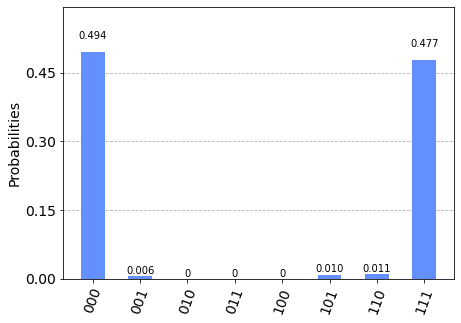

## Select a target to run your program

To check your code before running it on actual quantum hardware, you can use the IonQ quantum simulator, `ionq.simulator`.

Add a new cell and create an object to represent the IonQ quantum simulator target:

```python
# Get IonQ quantum simulator target:
simulator_backend = provider.get_backend("ionq.simulator")
```

## Run on the IonQ simulator 

To run your circuit on the simulator, add the following code which uses the `run` method of the target to submit your job, and then monitors the job status. 

```python
# Submit the circuit to run on Azure Quantum
job = simulator_backend.run(circuit, shots=100)
job_id = job.id()
print("Job id", job_id)

# Monitor job progress and wait until complete:
job_monitor(job)
```

The job status is displayed in realtime:

```output
Job id 7d909574-98d4-11ec-b382-00155d957f5d
Job status: job is queued
Job status: job is actively running
Job status: job has successfully run
```

When the job has successfully run, get the job results and display them:

```python
# Get the job results:
result = job.result()
print(result)
```

```output
Result(backend_name='ionq.simulator', backend_version='1', qobj_id='Qiskit Sample - 3-qubit GHZ circuit', job_id='7d909574-98d4-11ec-b382-00155d957f5d', success=True, results=[ExperimentResult(shots=100, success=True, meas_level=2, data=ExperimentResultData(counts=defaultdict(<class 'int'>, {'000': 50, '111': 50}), probabilities=defaultdict(<class 'int'>, {'000': 0.5, '111': 0.5})), header=QobjExperimentHeader(meas_map='[0, 1, 2]', name='Qiskit Sample - 3-qubit GHZ circuit', num_qubits='3', qiskit='True'))])
```

Because this `result` type is an object native to the Qiskit package, you can use
Qiskit\'s `result.get_counts` and `plot_histogram` to visualize the
results. To make sure that all possible bitstring labels are represented,
add them to `counts`.

```python
counts = {format(n, "03b"): 0 for n in range(8)}
counts.update(result.get_counts(circuit))
print(counts)
plot_histogram(counts)
```

```output
{'000': 50, '001': 0, '010': 0, '011': 0, '100': 0, '101': 0, '110': 0, '111': 50}
```


## Estimate job cost

Before running a job on actual quantum hardware, or a [quantum processing unit](xref:microsoft.quantum.target-profiles) (QPU), you can estimate how much it will cost to run. 

First, get the list of available providers again:

```python
print("This workspace's targets:")
for backend in provider.backends():
    print("- " + backend.name())
```

```output
This workspace's targets:
- ionq.qpu
- ionq.simulator
- ionq.qpu.aria-1
- microsoft.estimator
- quantinuum.qpu.h1-1
- quantinuum.sim.h1-1sc
- quantinuum.qpu.h1-2
- quantinuum.sim.h1-2sc
- quantinuum.sim.h1-1e
- quantinuum.sim.h1-2e
- rigetti.sim.qvm
- rigetti.qpu.aspen-m-2
```
<!--- rigetti.qpu.aspen-m-3 --->

Next, create an object to represent the [IonQ quantum computer](xref:microsoft.quantum.providers.ionq#quantum-computer):

```python
qpu_backend = provider.get_backend("ionq.qpu")
```

To estimate the cost of running a job on the QPU, add and run a new cell using the `estimate_cost` method of the target:

```python
cost = qpu_backend.estimate_cost(circuit, shots=100)

print(f"Estimated cost: {cost.estimated_total}")
```

This displays the estimated cost in USD.

For the most current pricing details, see [IonQ Pricing](xref:microsoft.quantum.providers-pricing#ionq), or find your workspace and view pricing options in the **Providers** blade of your workspace.

## Run on IonQ QPU

After running successfully on the IonQ simulator and estimating the QPU cost, it's time to run your circuit on the hardware. 

> [!NOTE] 
> The time required to run a circuit on the QPU varies depending on current queue times. You can view the average queue time for a target by selecting the **Providers** blade of your workspace.

Use the same `run` method and operations that you used previously with the API Validator to submit and monitor your job:

```python
# Submit the circuit to run on Azure Quantum
job = qpu_backend.run(circuit, shots=1024)
job_id = job.id()
print("Job id", job_id)

# Monitor job progress and wait until complete:
job_monitor(job)
```

```output
Job id 54e8c740-98d9-11ec-b382-00155d957f5d
Job Status: job has successfully run
```

When the job has successfully run, get the job results as before and display them in a chart:

```python
result = job.result()
print(result)
counts = {format(n, "03b"): 0 for n in range(8)}
counts.update(result.get_counts(circuit))
print(counts)
plot_histogram(counts)
```

```output
Job id 910b5ac8-98cd-11ec-b3ba-00155d5528cf
Job Status: job has successfully run
Result(backend_name='ionq.simulator', backend_version='1', qobj_id='Qiskit Sample - 3-qubit GHZ circuit', job_id='Job id 54e8c740-98d9-11ec-b382-00155d957f5d', success=True, results=[ExperimentResult(shots=1024, success=True, meas_level=2, data=ExperimentResultData(counts={'0': 505, '1': 6, '2': 1, '3': 1, '4': 1, '5': 10, '6': 11, '7': 488}, probabilities={'0': 0.4932, '1': 0.0059, '2': 0.001, '3': 0.001, '4': 0.001, '5': 0.0098, '6': 0.0117, '7': 0.4766}), header=QobjExperimentHeader(name='Qiskit Sample - 3-qubit GHZ circuit', num_qubits='3', qiskit='True'))])
{'000': 505, '001': 6, '010': 1, '011': 1, '100': 1, '101': 10, '110': 11, '111': 488}
```



