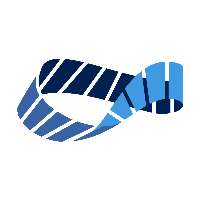

<table>
<tr><td><H1> Welcome to the Microsoft Quantum Developer Kit internal preview</td><td></td></tr>
</table> 

Thank you for accepting our invitation to test the Microsoft Quantum Developer Kit preview. Your participation will help the Quantum Architectures and Computation (QuArC) team improve the Microsoft quantum development experience. We hope that our beta testers will become the nucleus of a quantum development community that will develop new algorithms and techniques extend the reach of quantum computing.

Microsoft's Q# language brings new power and flexibility to the art of quantum computing. Q# and it's supporting compiler, libraries, simulators and Visual Studio development environment comprise a significant step toward a more industrial strength computing environment.

## Beta feedback procedure
The QuArC team is soliciting your feedback about all parts of the Quantum Developer Kit. We anticipate receiving a lot of input and it will help us manage it if you put one of the following "channels" in the subject of your email.
- Q# language
- Local simulator
- Trace simulator
- Libraries
- Documentation
 
Please email the feedback to <qdkfeed@microsoft.com>

## Microsoft Quantum Developer Kit components
The Quantum Developer Kit preview provides a complete development and simulation environment that contains the following components.
> [!div class="mx-tdBreakAll"]
> |Component|Function|
> |--------------------|---------------------------------------------------|
> |Q# language and compiler|Q# is a domain-specific programming language used for expressing quantum algorithms. It is to be used for writing sub-programs that execute on an adjunct quantum processor, under the control of a classical host program and computer.|
> |Q# standard library| The contains operations and functions that support both the classical language control requirement and the Q# quantum algorithms.  
> |Local quantum machine simulator| A full state vector simulator optimized for accurate vector simulation and speed.|
> |Quantum computer trace simulator| The trace simulator does not simulate the quantum environment like the local quantum simulator. It is used to estimate the resources required to execute a quantum program and also allow faster debugging of the non-Q# control code.|

## Beta feedback procedure
The QuArC team is soliciting your feedback about all parts of the Quantum Developer Kit. We anticipate receiving a lot of input and it will help us manage it if you put one of the following "channels" in the subject of your email.
- Q# language
- Local simulator
- Trace simulator
- Libraries
- Documentation 
Please email the feedback to qdkfeed@microsoft.com

The current documentation includes:
* [Quantum computing concepts](quantum-concepts-1-Intro.md) includes topics such the relevance of linear algebra in quantum computing, the nature and use of a qubit, how to read a quantum circuit, and more.
* [Installation and configuration](quantum-InstallConfig.md) describes how to quickly set up your quantum development environment. Your Visual Studio environment will be enhanced with a compiler for the Q# language and templates for Q# projects and files.
* [Quickstart- your first quantum program](quantum-WriteAQuantumProgram.md) walks you through how to create the Teleport application in the Visual Studio development environment. You'll learn how to define a Q# operation, call the Q# operation using C#, and how to execute your quantum algorith. 
* [Quantum development techniques](quantum-devguide-1-Intro.md)
* [Q# standard libraries](libraries/intro.md)
* [Q# language reference](quantum-QsharpReference.md)
* [For more information](quantum-ForMoreInfo.md)
* **Quantum trace simulator reference**
* [Q# library reference](api/overview.md)

