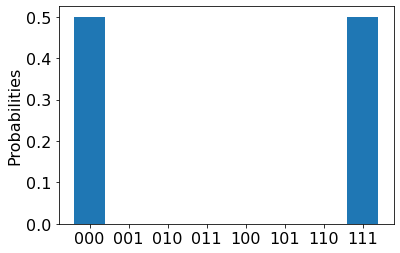

---
author: guenp
description: Learn how to install the Azure Quantum SDK for Python to submit Quantum circuits to Azure Quantum.
ms.author: v-guenp
ms.date: 08/25/2021
ms.service: azure-quantum
ms.subservice: qdk
ms.topic: quickstart
no-loc: ['Python', '$$v']
title: Submit quantum circuits to IonQ and Honeywell with Python
uid: microsoft.quantum.install-qdk.overview.azure-sdk-python
--- 

# Submit quantum circuits to IonQ and Honeywell with Python

Learn how to install the Azure Quantum SDK for Python and submit basic Quantum circuits to Azure Quantum. For more information, see [Quantum circuits](xref:microsoft.quantum.concepts.circuits).

## Install the `azure-quantum` Python package

The `azure-quantum` Python package contains the necessary functionality for connecting to the Azure Quantum Workspace and submit quantum circuits to the Quantum Computing targets such as [IonQ](xref:microsoft.quantum.providers.ionq) and [Honeywell](xref:microsoft.quantum.providers.honeywell).

1. Install [Python](https://www.python.org/downloads/) 3.6 or later in case you haven't already.
1. Install [PIP](https://pip.pypa.io/en/stable/) and ensure you have **version 19.2 or higher**.
    > Optionally, if you are using [Miniconda](https://docs.conda.io/en/latest/miniconda.html) or [Anaconda](https://www.anaconda.com/products/individual#Downloads), create a new environment by downloading the [environment.yml](https://github.com/microsoft/qdk-python/blob/main/azure-quantum/environment.yml) file and running the following:
    >```
    >conda env create -f environment.yml
    >```
    > This creates a new conda environment that you can activate with the following:
    >```
    >conda activate azurequantum
    >```

1. Install the package using pip:

    ```
    pip install azure-quantum
    ```

1. Start your favorite code editor or interactive Python tool, such as [VS Code](https://code.visualstudio.com/docs/python/jupyter-support-py), [Jupyter](https://jupyter.readthedocs.io/en/latest/content-quickstart.html) or [iPython](https://ipython.readthedocs.io/en/stable/interactive/tutorial.html).

## Submit a quantum circuit to IonQ

1. Create a quantum circuit using the the language-agnostic JSON format supported by the [IonQ targets](xref:microsoft.quantum.providers.ionq) as described in the [IonQ API documentation](https://docs.ionq.com/#tag/quantum_programs). For instance, the below example creates a superposition between three qubits:

    ```python
    circuit = {
        "qubits": 3,
        "circuit": [
            {
            "gate": "h",
            "target": 0
            },
            {
            "gate": "cnot",
            "control": 0,
            "target": 1
            },
            {
            "gate": "cnot",
            "control": 0,
            "target": 2
            },
        ]
    }
    ```

1. Submit the circuit to the IonQ target. In the below example we are using the IonQ simulator. This returns a `Job` (for more info, see [Azure Quantum Job](xref:microsoft.quantum.optimization.job-reference)).

    ```python
    target = IonQ(workspace=workspace, target="ionq.simulator")
    job = target.submit(circuit)
    ```

1. Wait until the job is complete and fetch the results.

    ```python
    results = job.get_results()
    results
    ```

    ```output
    .....
    {'duration': 8240356, 'histogram': {'0': 0.5, '7': 0.5}}
    ```

1. Visualize the results

We can then visualize the results using [Matplotlib](https://matplotlib.org/stable/users/installing.html).

```python
%matplotlib inline
import pylab as pl
pl.rcParams["font.size"] = 16
hist = {format(n, "03b"): 0 for n in range(8)}
hist.update({format(int(k), "03b"): v for k, v in results["histogram"].items()})
pl.bar(hist.keys(), hist.values())
pl.ylabel("Probabilities")
```



## Submit a quantum circuit to Honeywell

1. Create a quantum circuit in the [OpenQASM](https://en.wikipedia.org/wiki/OpenQASM) representation. For instance, the below example creates a Teleportation circuit:

    ```
    circuit = """
    OPENQASM 2.0;
    include "qelib1.inc";
    qreg q[3];
    creg c0[3];
    h q[0];
    cx q[0], q[1];
    cx q[1], q[2];
    measure q[0] -> c0[0];
    measure q[1] -> c0[1];
    measure q[2] -> c0[2];
    """
    ```

    Optionally, you can load the circuit from a file:

    ```py
    with open("my_teleport.qasm", "r") as f:
        circuit = f.read()
    ```

1. Submit the circuit to the Honeywell target. In the below example we are using the Honeywell API validator. This returns a `Job` (for more info, see [Azure Quantum Job](xref:microsoft.quantum.optimization.job-reference)).

    ```python
    target = Honeywell(workspace=workspace, target="honeywell.hqs-lt-s1-apival")
    job = target.submit(circuit, num_shots=500)
    ```

1. Wait until the job is complete and fetch the results. Note that the API validator only returns zeroes for qubit read-out results.

    ```python
    results = job.get_results()
    results
    ```

    ```output
    ........
    {'c0': ['000',
    '000',
    '000',
    '000',
    '000',
    '000',
    '000',
    ...
    ]}
    ```

1. Visualize the results

We can then visualize the results using [Matplotlib](https://matplotlib.org/stable/users/installing.html).

```python
%matplotlib inline
import pylab as pl
pl.hist(results["c0"])
pl.ylabel("Counts")
pl.xlabel("Bitstring")
```


