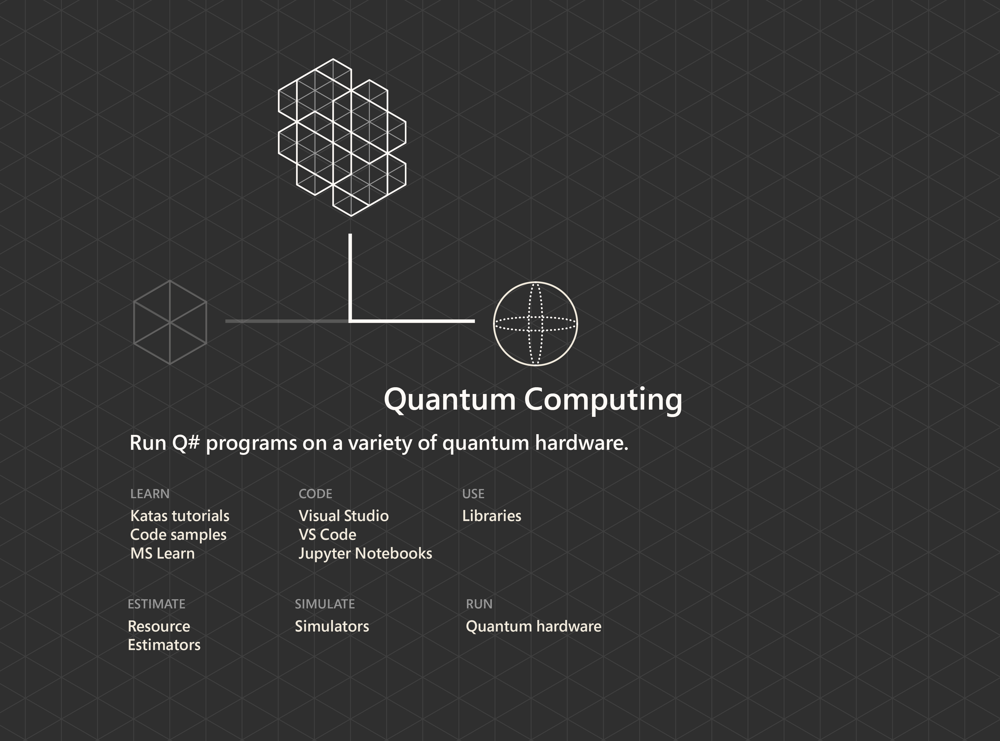

# What is quantum computing?

Harnessing the unique behavior of quantum physics and applying it to computing, quantum computers introduce new concepts to traditional programming methods, making use of quantum physics behaviors such as superposition, entanglement, and quantum interference.

Quantum computing holds the promise to solve some of our planet's biggest challenges - in the areas of environment, agriculture, health, energy, climate, materials science, and others we haven't encountered yet. For some of these problems, even our most powerful computers run into problems. While quantum technology is just beginning to impact the computing world, it could be far-reaching and change the way we think about computing.

In modern usage, the word quantum means the smallest possible discrete unit of any physical property, usually referring to properties of atomic or subatomic particles. Quantum computers use actual quantum particles, artificial atoms, or collective properties of quantum particles as processing units, and are large, complex, and expensive devices.

## What can a quantum computer do?

A quantum computer isn't a supercomputer that can do everything faster, but there are a few areas where quantum computers do exceptionally well.

- [Quantum simulation](xref:microsoft.quantum.overview.qdk-overview#quantum-simulation)
- [Cryptography](xref:microsoft.quantum.overview.qdk-overview#cryptography-and-shors-algorithm)
- [Search](xref:microsoft.quantum.overview.qdk-overview#search-and-grovers-algorithm)
- [Optimization](xref:microsoft.quantum.overview.qdk-overview#quantum-inspired-computing-and-optimization)
- [Machine learning](xref:microsoft.quantum.overview.qdk-overview#quantum-machine-learning)

## Quantum simulation

Since quantum computers use quantum phenomena in computation, they are well suited for modeling other quantum systems. Photosynthesis, superconductivity, and complex molecular formations are examples of quantum mechanisms that quantum programs can simulate.

## Cryptography and Shor’s algorithm

In 1994, Peter Shor showed that a scalable quantum computer could break widely used encryption techniques such as the RSA algorithm. Classical cryptography relies on the intractability of problems such as integer factorization or discrete logarithms, many of which can be solved more efficiently using quantum computers.

## Search and Grover’s algorithm

In 1996, Lov Grover developed a quantum algorithm that dramatically sped up the solution to unstructured data searches, running the search in fewer steps than any classical algorithm could.

## Quantum-inspired computing and optimization

Quantum-inspired algorithms use quantum principles for increased speed and accuracy but implement on classical computer systems. This approach allows developers to leverage the power of new quantum techniques today without waiting for quantum hardware, which is still an emerging industry.

Optimization is the process of finding the best solution to a problem, given its desired outcome and constraints. Factors such as cost, quality, or production time all play into critical decisions made by industry and science. Quantum-inspired optimization algorithms running on today's classical computers can find solutions that up to now have not been possible. In addition to optimizing traffic flow to reduce congestion, there is airplane gate assignment, package delivery, job scheduling and more. With breakthroughs in materials science, there will be new forms of energy, batteries with larger capacity, and lighter and more durable materials.

> [!NOTE]
> Read more about how Microsoft quantum-inspired computing is being used in [materials science](https://cloudblogs.microsoft.com/quantum/2020/01/21/oti-lumionics-accelerating-materials-design-microsoft-azure-quantum/), [risk management](https://cloudblogs.microsoft.com/quantum/2019/05/22/microsoft-quantum-collaborates-with-willis-towers-watson-to-transform-risk-management-solutions/), and [medicine](https://blogs.microsoft.com/blog/2018/05/18/microsoft-quantum-helps-case-western-reserve-university-advance-mri-research/).

## Quantum machine learning

Machine learning on classical computers is revolutionizing the world of science and business. However, the high computational cost of training the models hinders the development and scope of the field. The area of quantum machine learning explores how to devise and implement quantum software that enables machine learning that runs faster than classical computers.

The Quantum Development Kit comes with the [quantum machine learning library](xref:microsoft.quantum.libraries.overview#quantum-machine-learning-library) that gives you the ability to run hybrid quantum/classical machine learning experiments. The library includes samples and tutorials, and provides the necessary tools to implement a new hybrid quantum–classical algorithm, the circuit-centric quantum classifier, to solve supervised classification problems.

## Q# and the Microsoft Quantum Development Kit (QDK) 

Q# is Microsoft's open-source programming language for developing and running quantum algorithms. It is part of the [QDK](xref:microsoft.quantum.azure-quantum-overview#what-is-q-and-the-quantum-development-kit), a full-featured development kit for Q# that you can use with standard tools and languages to develop quantum applications that you can run in various environments, including the built-in full-state quantum simulator.

There are extensions for Visual Studio and VS Code, and packages for use with Python and Jupyter Notebook.

The QDK includes a standard library along with specialized chemistry, machine learning, and numerics libraries.

The documentation includes a Q# language guide, tutorials, and sample code to get you started quickly, and rich articles to help you dive deeper into quantum computing concepts.  

## Microsoft quantum hardware partners

Microsoft is partnering with quantum hardware companies to provide developers with cloud access to quantum hardware. Leveraging the [Azure Quantum](https://azure.microsoft.com/services/quantum/) platform and the Q# language, developers will be able to explore quantum algorithms and run their quantum programs on different types of quantum hardware.

[IonQ](https://ionq.com/news/november-4-2019-microsoft-partnership) and [Honeywell](https://www.honeywell.com/newsroom/news/2019/11/the-future-of-quantum-computing) both use **trapped ion-based** processors, utilizing individual ions trapped in an electronic field, whereas [QCI](https://quantumcircuits.com/news-and-publications/quantum-circuits-partners-with-microsoft-on-azure-quantum) uses superconducting circuits.

## Next steps

- [Key concepts for quantum computing](xref:microsoft.quantum.overview.understanding)
- [Set up Azure Quantum](xref:microsoft.quantum.install-qdk.overview)
